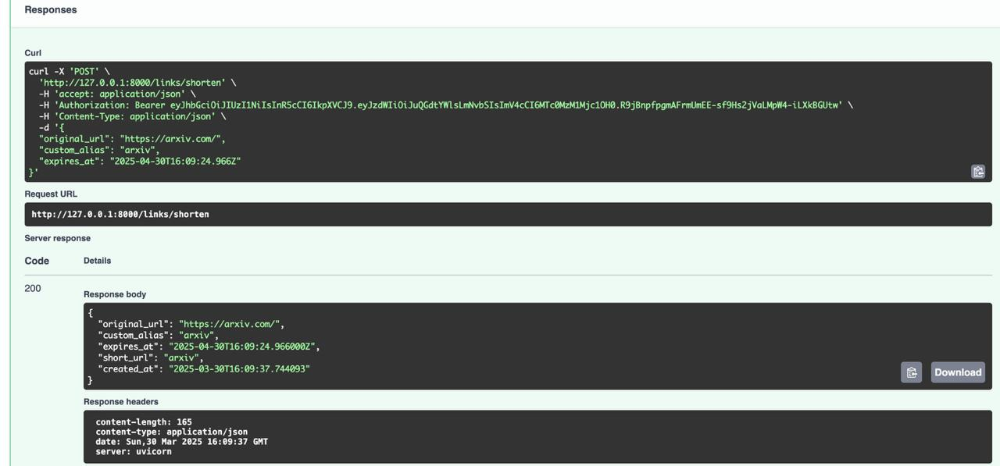
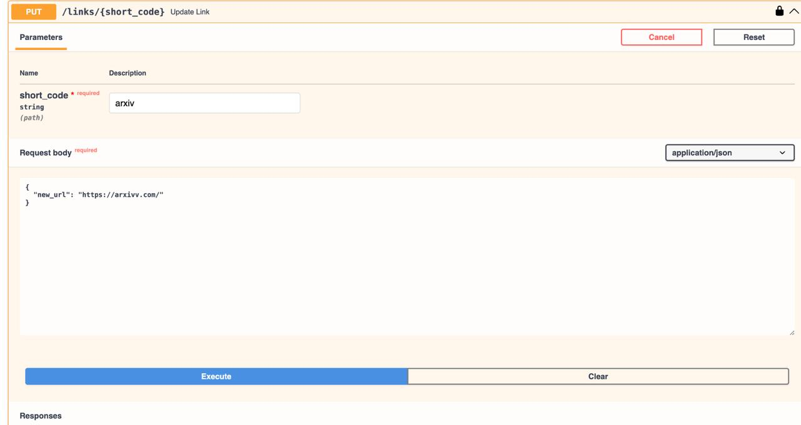

# Отчет по реализации сервиса

## Обязательный функционал (релизованы весь необходимые функции)

### 1. Базовые операции с ссылками (CRUD)
- **Создание (POST /links/shorten)**  
  Поддержка генерации коротких ссылок с:  
  - Автоматической генерацией кода или кастомным алиасом  
  - Указанием времени жизни (`expires_at`)  
  - Проверкой уникальности алиаса
  

- **Редирект (GET /{short_code})**  
  - Перенаправление на оригинальный URL  
  - Автоматическое архивирование при истечении срока  
  - Кэширование запросов
    

- **Обновление (PUT /{short_code})**  
  - Изменение оригинального URL (только для владельца ссылки)  
  - Инвалидация кэша
    

- **Удаление (DELETE /{short_code})**  
  - Удаление ссылки (только для владельца ссылки)  
  - Очистка кэша
    
 

### 2. Статистика переходов (GET /{short_code}/stats)
- Отображение:  
  - Количества переходов  
  - Даты создания и последнего использования  
  - Срока действия ссылки  
- Кэширование результатов на 1 минуту
  
 

### 3. Кастомные алиасы
- Проверка уникальности через БД  
- Запрет использования занятых алиасов  

### 4. Поиск по оригинальному URL (GET /links/search)
- Возврат всех совпадений  
- Кэширование результатов поиска
  
  

### 5. Время жизни ссылок
- Автоматическая архивация при истечении `expires_at`  
- Ручное указание даты удаления с точностью до минуты
- В случае, если пользователь указывает только year-month-day без точного времени, то автоматически прибавляется +3 месяца с даты создания ссылки в качестве expire date

---

## Дополнительные функции

### 1. История архивированных ссылок
- Просмотр архивированных ссылок (GET /links/archive)  
- Фильтрация по пользователю
  

### 2. Группировка по проектам
- Создание проектов  
- Привязка ссылок к проектам
  

---

## Система аутентификации
- Регистрация/вход по JWT-токенам (почта + пароль) 
- Защита операций изменения данных:  
  - Проверка прав владельца  
  - Запрет модификации анонимных ссылок
    

---

## Архитектура хранения данных

### База данных (SQLite)

### Кэширование (Redis)
- **Сценарии использования:**  
  - Редиректы (TTL: 1 час)  
  - Статистика (TTL: 1 минута)  
  - Результаты поиска (TTL: 1 час)  
- **Инвалидация кэша** при изменении/удалении ссылок

## Итоговый вид интерфейса FastAPI

---

## Вывод
- **Реализованы все обязательные функции, включая кэширование всех GET эндпоинтов, авторизацию и хранение в базе дынных (SQLite)**
- **Реализованы все дополнительные функции, включая архиварование ссылок и группировку ссылок по проектам**

## Инструкция по запуску
- pip install -r requirements.txt
- установка Redis (локально)
- uvicorn src.main:app --reload
- pytest --cov=src tests/
