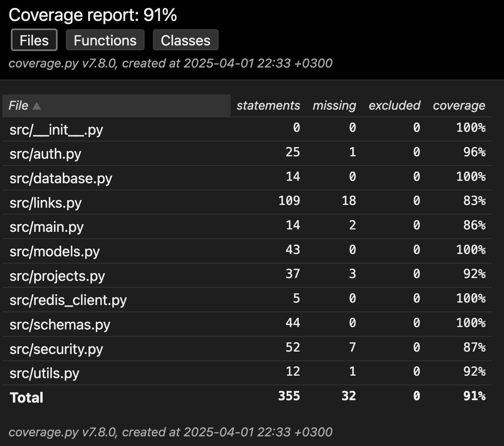

# Отчет по тестированию сервиса

## Все необходимые тесты были успешно проведены, в частности:

## 1) Юнит-тесты

- **Покрытие модулей `utils`, `security`, `schemas`, `database`**
- Проверяются:
  - Генерация коротких ссылок
  - Обработка дат истечения
  - Хэширование паролей и создание JWT
  - Pydantic-валидация

**Папка**: `tests/units/`

---

## 2) Функциональные тесты

- **Покрытие всего API-сервиса через TestClient и httpx**
- Проверяются:
  - Создание коротких ссылок (с кастомным и авто-генератором)
  - Обработка повторных alias (409)
  - Редиректы по short_code
  - Получение статистики (и 404 для несуществующих)
  - Обновление и удаление ссылок (PUT/DELETE)
  - Архивация просроченных ссылок (410 + перенос в архив)
  - Управление проектами (создание, получение, добавление ссылок)
  - Ошибки доступа (401, 403, 404)
  - Поиск по original_url

**Стек**: `httpx`, `pytest`, `FastAPI TestClient`  
**Папка**: `tests/functional/`

---

## 3) Мокирование и тестовая база

- Используется **тестовая SQLite** (`/tests/test.db`)
- Через `override_get_db()` обеспечено безопасное подключение во всех тестах
- Redis очищается перед каждым тестом
- Отдельный пользователь создаётся через фикстуру

## 4) Нагрузочное тестирование (см. `/reports-for-tests/Locust.pdf` и `/reports-for-tests/Locust_2025-04-01-22h22_locust_file.py_ http___localhost_8000.html`)

---

## 5) Покрытие кода тестами = 91% (см. `/reports-for-tests/index-coverage-pytests.html`)

